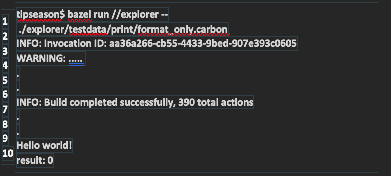
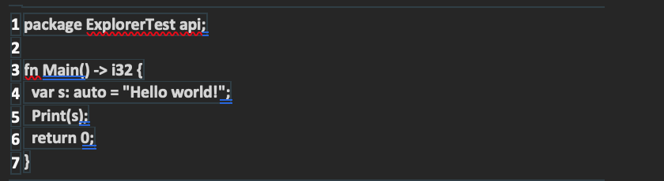

Google introduced Carbon language as the next generation programming language **proxy to C++ programming language**. In this article we will learn about various aspects of Carbon language and Carbon language basic syntax along with cod examples that you can use to get started with Carbon Programming language. 

<!-- truncate -->

C++ is a programming language that has been used since 1983, and it's an important tool in most codebases and overtime, it has built up a lot of technical debt. ***When it comes to creating high-performance low-level systems, it is by far the most widely used language***. 

Originally demonstrated by Chandler Carruth in[CppNorth](https://cppnorth.ca/) Conference, Carbon language looks like a great alternative to C++ 

However there are various development breakthroughs that Carbon has to make if it's going to replace C++.

**Let's Get Started**

## Pre-Requisites

To comprehend the above programming language Article, a wide scope knowledge of C++ language is needed, however, if you are new to programming, this article will give you a dive guide about what carbon language is, and how to start coding and building up and it.**

## What is Carbon Language and Why?

Note: Carbon language is not inherited from C or C++. It's built from scratch with modern language fundamentals such as Generics, Modular code, Consistent, Simple syntax. 

**Some of the key aspects of Carbon languages includes:**

1. Building on top of an existing ecosystem.
2. Bi-directional interoperability
3. Optimize learning curve
4. Modern tooling systems like package manager etc.

## Challenges with C++ Programming Language

C++ is already a great language to work with. It gives high performance and is widely used in many production systems. It can also run with multiple platforms, hardware architecture and many operating systems. 

However some of the problems with C++ are:

1. Accumulated technical debt (e.g. Integer promotion rules) across various functionalities. 
2. Backward compatibility with C makes it even more hard to fix tech debt and make code changes hard to implement.
3. Evolution process to add new functionalities to C++ is very difficult as it needs to adhere to ISO process overhead, preventing from experimentation etc.**

So C++ is falling short of some of it's goals like performance, software and language evolution, ability to easily read and write the code, fast and scalable development and so on.

Since solving these problems with C++ is really hard, after a deep research and evaluation, across multiple languages by Google engineers **Carbon programming language** is introduced. So it is like a successor to C++ similar to: 

- **C - C++**
- **JavaScript -TypeScript**
- **Objective-C - Swift**
- **Java - Kotlin**
- **C++ - Carbon Language**

## Key Features of Carbon Language

1. Fast performance: Matching C++ using LLVM (low level virtual machine), having low level access to bits and addresses, will drive faster performance. 

2. Bi-directional Interoperability: indicates that you can call C++ language code from Carbon language and Carbon language code from C++.

3. Migration: Carbon provides support to migrate code from C++.

4. Modern and evolving: Carbon provides features that makes it fast and scalable. Providing builds that can work with existing C++ builds.

5. Built with Open Source: Carbon is an Open Source project with clear goals and priorities, with great compilers, compiler libraries, documentation, package manager etc.

## How to setup and install Carbon language:

Getting started with Carbon language involves installation of:

1. Homebrew: This is a package installation tool. If you don't have homebrew installed you can follow these [instructions](https://brew.sh/). 

In MacOs you can install homebrew using `/bin/bash -c "$(curl -fsSL https://raw.githubusercontent.com/Homebrew/install/HEAD/install.sh)"`

2. Bazel: Bazel is an open-source build and test tool which can support multiple languages, platforms.

To install Bazel on MacOS: 
`$ brew install bazelisk` for more information to install Bazel on other OS, please follow this link: (Bazel Installation Guide)[https://bazel.build/install]

This should automatically install and setup Bazel that is ready to use. If you have any errors related to permissions, the error message from Bazel will have useful command to run. Try to run that command using sudo.

3. LLVM: LLVM is a low level virtual machine that Carbon language uses to run. You may not need to have full knowledge of LLVM to follow this tutorial.

**LLVM is the core virtual machine on which carbon language is run on.**

To Install LLVM:
**To install LLVM on MacOS**
`$ brew install llvm`
`$ export PATH="$(brew --prefix llvm)/bin:${PATH}"`

One thing to note is MacOS has a default LLVM . So using ***brew install LLVM*** may give a message like  LLVM is keg-only, which means it was not symlinked.

To find out more, check out (https://llvm.org/)[LLVM]. 

4. Carbon Explorer: Carbon explorer is like an implementation tool to Carbon language. To run all the programs of Carbon lang, we will use carbon explorer.

### Setting up Carbon language Code
To setup Carbon language code,run the commands below on a MacOS Terminal: 
1. `$ git clone https://github.com/carbon-language/carbon-lang`
2. `$ cd carbon-lang`

### Writing a Hello world Program in Carbon Programming language

Now that we have setup Carbon language, let's run our first program. To do that we will use Carbon explorer to run. To run your first code in Carbon, make sure you are in the **carbon-lang**
directory that you cloned from git and then run below command.

`$ bazel run //explorer -- ./explorer/testdata/print/format_only.carbon`

***What this command is doing, is to invoke Bazel build tool to trigger explorer code that in turns runs the actual code present in the ./explorer/testdata/print/format_only.carbon file***

**Once you run this you should see  Hello world in Carbon output like this**

As you can see “Hello World!” is printed and return type of main is int32 resulting to 0. 

The code that is behind this hello world program is
File path:./explorer/testdata/print/format_only.carbon

For windows, Carbon language is not yet natively supported. However you can install ***wsl*** which is like installing Linux on top of windows.   

You can do that using `wsl --install` and then perform above steps.

The file extension for Carbon language code is carbon. So if you write new carbon language file you need to have a file which ends with extension of .carbon. 
Example: demo.carbon .

Now that we have carbon language setup, let’s look at some of the basic syntax of Carbon language.

### Carbon Language Basic Syntax with examples:
Carbon language is still in experimental phases. While most of the design choices are made already, some of the syntax and usage might change as things evolve. So keep that in mind while working with Carbon-lang. 

One great thing about Carbon is that the syntax should be C/C++ developer friendly and easy to understand.

For the best use of this tutorial, to follow along with each of these examples, you can run the below examples using Carbon language explorer that you installed in the previous step. 

If you are running in your own machine, you can create new files each time you run a program or modify **./explorer/testdata/print/format_only.carbon** file to check the examples.

Each time you modify the code,run 
`bazel run //explorer -- ./explorer/testdata/print/format_only.carbon`

**Note: format_only.carbon is just a sample file. Change it to whichever filename you created.**

Alternatively, you can also use Carbon online explorer IDE to run through the below examples.

Just copy paste below examples in the online IDE and you can see live results.

Link for online carbon explorer IDE is at (https://carbon.godbolt.org/)[Carbon Godbolt] or (https://carbon.compiler-explorer.com/)[Carbon online explorer].

Let’s get started on how to use carbon language:

**Declarations in carbon lang:**
1. Methods/Functions are declared using ***fn*** keyword.
2. Variables are declared using ***var*** keyword.
3. Variable names should end with: followed by space eg: ***var x***.
4. Constants can be declared using ***let*** keyword.
5. Packages are declared using ***package*** keyword.
6. Comments in Carbon language can be declared using two slashes ***//***
7. ***Auto*** can be used to automatically infer the variable type. It can be used in combination of ***let or var*** or as function return types.

***Example/ Demo code:***
` package ExplorerTest api; //fn is function delcaration // return type is i32 i.e.e init. fn Main() -> i32 {//I am a comment. var s: auto = "Hello world!"; // Auto Variable let x: i32 = 20; //Constant var y: i32 = 3; // Integer variable Print(s); // Print return 0; //Return value } `

## Functions/Methods in Carbon
Functions can be declared using ***fn** keyword. . The syntax is ***fn MethodName (var param: type ... ) -> return type***. 

For void or empty return types, you can ignore the part after ***->***

**********Code Sample:**:**:**:**:** 
` package ExplorerTest api;//Integer return type fn Sum(var a: i32 var b: i32) -> i32 {return a + b;} //Empty or void return type. fn PrintCount(var count: i32) {Print("The count is {0}", count);}fn Main() -> i32 {Print("Sum is {0}", Sum(4, 6));PrintCount(10);return 0;}`

### Numeric Variables in carbon lang:

Variables in carbon language can be
1. bool for boolean true or false
2. i8, i16, i32, i64, i128, i256 for integer types.
3. u8, u16, u32, u128, u256 for unsigned integer types.
4. f16, f32, f64, and f128 for float types.
5. _ can be used for digit separators. Eg: 1_000_000 is still an integer if declared without quotes.

**Code Sample:**
`package ExplorerTest api;fn Main() -> i32 {var a: i32 = 1;var b: i32 = 2;Print(a + b);return 0;}`

### Strings in carbon language:
Strings can be declared using:
1. String for byte sequence
2. StringView as a read only reference for utf-8 byte sequence.

Strings literals can be declared in two ways:
1.	Single Line: Use double quotation mark(") for single line.
2.	Multi line string: For multi line string declaration use (""")

**Code Sample:**
`package ExplorerTest api;fn Main() -> i32 {var singleLine: String = "Hello world!";var multiLine: String = """hello line 1 TipSeason demo line 2 TipSeason demo line 3 """; //End of multi block return 0;} `

### Tuples in Carbon Language:
Tuples represent values with multiple coordinates. They can be declared using parenthesis ().

**Code Sample:**
`package ExplorerTest api; fn Main() -> i32 {var x: auto = (0, 1);Print("{0}", x[1]); return x[0];}`

Here (x,y,z) is a tuple with multiple coordinates. They can be accessed using the index.

### Pointers in Carbon language:
There are no null pointers in Carbon.

To represent a pointer that may not refer to a valid object, use the type Optional(T*) where T is the type, * represents value, & represents address.

**Code Sample:**
` package ExplorerTest api;fn Main() -> i32 {var x: i32 = 5;// changes x to 10 x = 10;Print("---"); Print("x = {0}", x);var y: i32* = &x;// changes x to 7 * y = 7;Print("---");Print("x = {0}", x);Print("y = {0}", *y);var z: i32* = &*y;// changes x to 0*z = 0;Print("---");Print("x = {0}", x);Print("y = {0}", *y);Print("z = {0}", *z);var w: i32 = *y;return w;}`

### Arrays in Carbon
Arrays are declared using array type and the size. Syntax is [type; size] Eg: var x array: [i32; 4] = (1,2,3,4);

**Code Sample:**
`package ExplorerTest api; fn Main() -> i32 {var xarray: [i32; 4] = (0, 1, 5, 6); // Integer array var index: i32 = 1; xarray[index] = 0;Print("{0}", xarray[0]);Print("{1}", xarray[0]);return xarray[0] + xarray[1];}`

### Conditional control flow with carbon

Combination of ***if*** , ***else*** can be used to control the conditional flow in Carbon.

**if-else Syntax:**

if(condition) {
 //doSomething
} else {
 //doSomething
} 

**if-else-if Syntax**

if(condition) {
 //doSomething
} else if (condition) {
 //doSomething
} else {
  //doSomething
}

**Code Sample:**

`package ExplorerTest api;fn Main() -> i32 {var x: i32 = 5;if(x == 5) {Print("{0} to word is FIVE", x);} else {Print("{0} is not known ", x);}return 0;}`

### Loops in Carbon Language
Standards looping statements are supported.

**While loop**
While loop can be declared using while(condition){ } syntax.

**Code Sample:**
`package ExplorerTest api; fn Main() -> i32 {var x: auto = 5; while (not (x == 0)) {x = x - 1; Print("{0}  ", x);}return x;}` 

### For Loop

For loop can be declared using ***for (loop conditions) { }***. 

**Code Sample:**
`package ExplorerTest api; fn Main() -> i32 {var names: [String; 4] = ("a", "b"); for (var name: String in names) {Console.Print(name);}return x;}`
### Match multiple conditions similar to Switch.

Carbon has match keyword which is similar to switch in C/C++. Syntax for match is: 

`match(condition) {case (condition) => {//doSomething;} default =>{//doSomething;}}`

**Code Sample:**

`package ExplorerTest api; fn Matcher(var num: i32) -> i32 {var number: auto = 10;match (number) {case 5 => {Print("Got 5");return number;}case 10 => {Print("Got 10");return number;}default => {Print("Default");return number;}}} fn Main() -> i32 {Matcher(5);Matcher(10); Matcher(2); return 0;}`

### Classes in Carbon Language:
Class in carbon language can be declared using class keyword. Class can have members and methods. 

Here is an example class implementation:

` package ExplorerTest api; class Sum {var a: i32; fn Add[me: Self](var num: i32) -> i32 {var total: i32 = me.a + num; return total;}}fn Main() -> i32 {var p1: Sum = {.a = 5};var total: i32 = p1.Add(5);Print("Total sum {0}" , total);return 0;}`

**Structs in Google Carbon Language:**

Structural types help you identify members using the name instead of their index/position. 

They are declared within curly braces 

var name: auto = {.name1 = value1, .name2 = value2, ... } and can be accessed using name.name1 etc.

**Code Sample:**
` package ExplorerTest api;fn Main() -> i32 {var point: auto = {.x_axis = 0, .y_axis = 1};point = {.x_axis = 5, .y_axis = -5};var result: i32 = point.x_axis * point.x_axis + point.y_axis * point.y_axis;Print("Result : {0}", result);return 0;}`
### Generics in Carbon Programming Language

Generics can be seen in many modern languages. They define a way to induce compile time type checks and helps define cleaner type variables. They can be declared using T parameter types are shown below.

**Code Sample:**
` package ExplorerTest api;fn GenericExample[T:! Type](x: T) -> T {return x;} fn Main() -> i32 {Print("Integer generic type {0}", GenericExample(0)); Print(GenericExample("This is a string generic"));return 0;}`

### Memory safety in Carbon language:
Carbon language has a heavy focus on memory management especially when it comes to memory safety. At a very high level carbon language plans to achieve memory safety using:

1. Spatial Memory safety
2. Temporal memory safety 

Here is a detailed tutorial on how memory safety is achieved in carbon along with goals and basics.Check(https://tipseason.com/carbon-language-memory-safety)[Carbon language memory safety for secure memory management] 

Finally, to end this article, I will be providing supporting links to find out more about (https://github.com/carbon-language/carbon-lang)[Carbon programming language]. 
