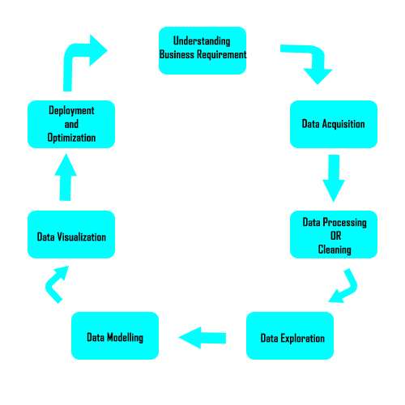

Data science is all about extracting knowledge and insights from data. 
If you wish to enter the **Data Science** world here is a brief tutorial as an introduction to Data Science. 

<!--truncate-->

## Introduction
Data Science techniques have become more and more relevant in the world as we know it.

It is used in major tech giant companies like Netflix, Google, Amazon and so many more, it’s also used for research purposes. 

## The stages of Data Science Analysis
These are the different stages that a data scientist go through when working on to extract knowledge from data. To extract this information, they employ various fit-to-purpose models based on **machine learning algorithms, statistics, and mathematical methods.**

### Understanding Business Requirement
One of the questions that every data scientist should ask whenever they are embarking on a data analysis project is: 
- ***What is the objective of this project?*** 
- ***What is my aim on analysing this data?*** 
- ***What do I wish to predict?*** 

It is required of a data scientist or anyone that wishes to gain insight from a data (raw or prepared) to know what they are looking for.

### Data Acquisition
This is the Gathering of data from different sources once you know your business plan or requirement then you have to acquire the data that will be used to get this answers be it raw or prepared but in some cases for example kaggle competitions the data is already given therefore this stage can be skipped.

This can be done through web scraping, surveys and downloading data from reliable sources.

### Data Processing or Cleaning
Most data that comes from real world sources usually have faulty data, missing values. This is caused maybe by human error i.e. filling wrong data or leaving a space blank or through errors in the formatting of the data it’s in this stage that data is checked and cleaned so that the model that is created can be trained on it. This stage is also one of the most time consuming stages of data science as you might be cleaning thousands of rows and features of data.

### Data Exploration
It’s in this stage that data scientist tries to understand the patterns between the features of a data and then gain useful insights on the data. It is also called Exploratory Data Analysis (EDA).

### Data Modelling
This is the building stage where data scientist builds a model that learns or trains on the data and predicts answers to the business requirement and also answers some of stage one questions. Many library’s and frameworks are used for making models examples are scikit learn, tensorflow, pytorch and so on. 

### Data Visualization
This stage can also be done when performing data exploration as it can also be used to gain insight from data. It consists of ***Plotted Graphs, Scatter diagrams, Bars and Histograms diagrams, Box Plots, Pair Plots and so on.***

It is also used to show readers interesting insights and relationship between features of data.

Therefore, this is an important stage of data science. Some examples of library’s and frameworks used in this stage are matplotlib and seaborn.

### Deployment and Optimization
This is the final stage for Data analysis and in this stage, your model has been trained. But the accuracy (how well your model can predict an unseen data) needs to be tested, and if the accuracy is low you need to increase this accuracy. This is done through (https://www.projectpro.io/article/8-feature-engineering-techniques-for-machine-learning/423)[Feature Engineering methods]. Examples of deployed models, are the google search engine, the google ads system and so many more.

## Conclusion
I hope you learnt something and you are intrigued about data science and wish to learn more on this vast and knowledgeable field.

